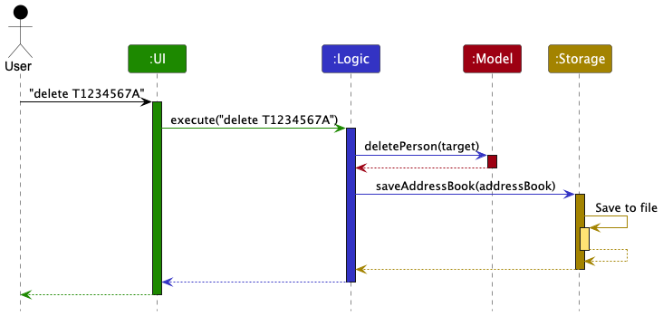
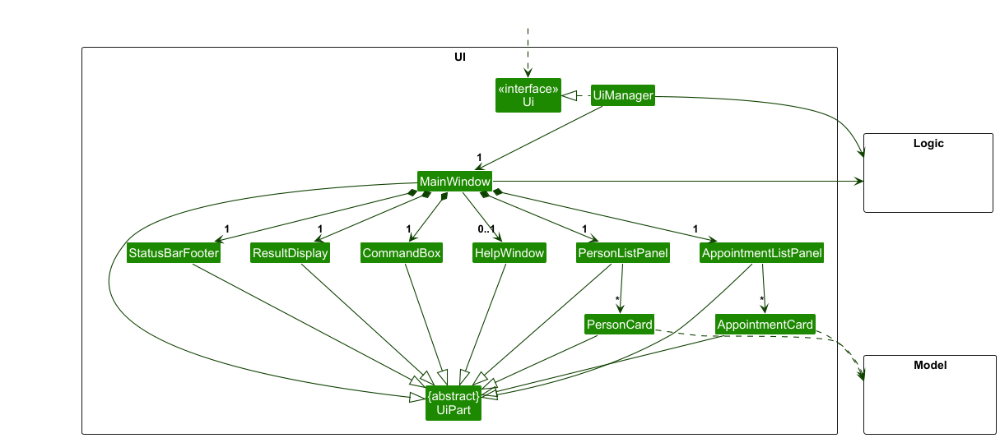
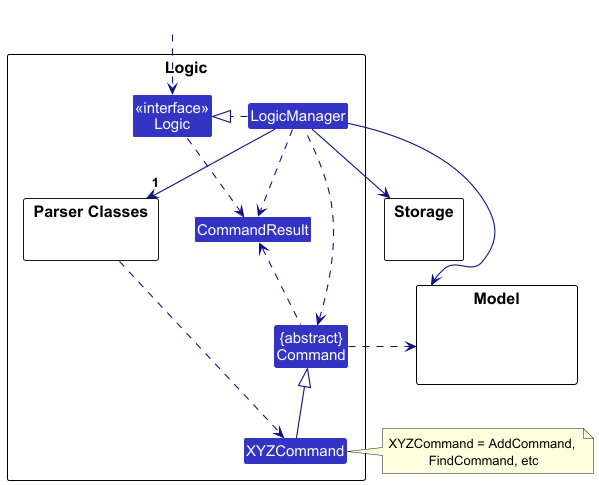
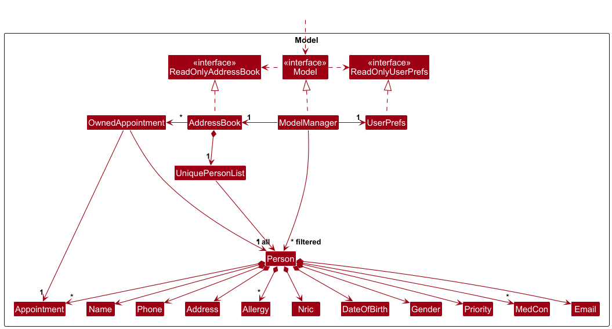
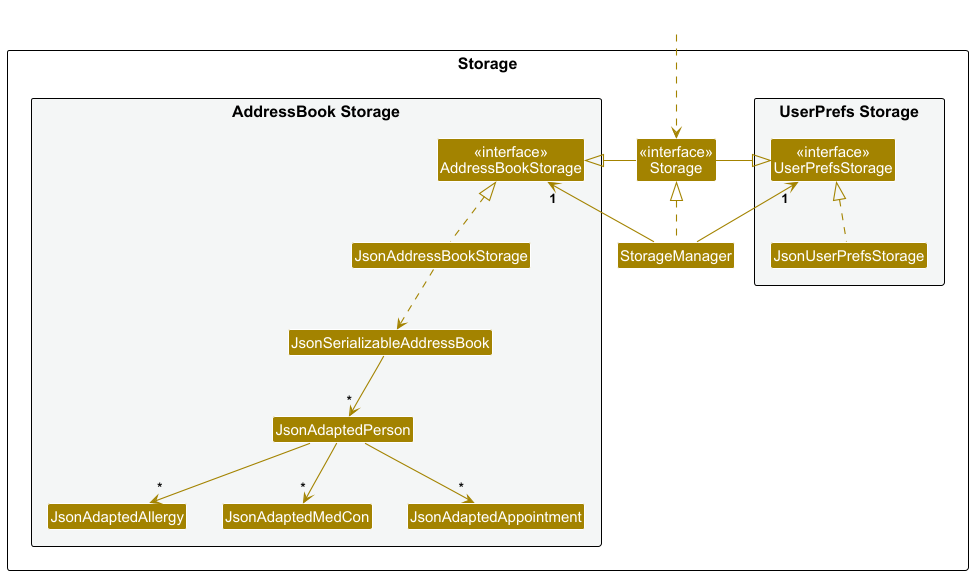
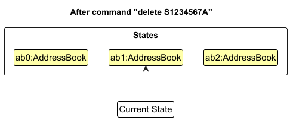

## Table of Contents

* Table of Contents
{:toc}

## **Acknowledgements**

* {list here sources of all reused/adapted ideas, code, documentation, and third-party libraries -- include links to the original source as well}

[Back to Table of Contents](#table-of-contents)
## **Setting up, getting started**

Refer to the guide [_Setting up and getting started_](SettingUp.md).

[Back to Table of Contents](#table-of-contents)
## **Design**

{: .alert .alert-primary}
:bulb: **Tip:** The `.puml` files used to create diagrams in this document `docs/diagrams` folder. Refer to the [_PlantUML Tutorial_ at se-edu/guides](https://se-education.org/guides/tutorials/plantUml.html) to learn how to create and edit diagrams.

[Back to Table of Contents](#table-of-contents)
### Architecture

{:width="280"}

The ***Architecture Diagram*** given above explains the high-level design of the App.

Given below is a quick overview of main components and how they interact with each other.

**Main components of the architecture**

**`Main`** (consisting of classes [`Main`](https://github.com/se-edu/addressbook-level3/tree/master/src/main/java/seedu/address/Main.java) and [`MainApp`](https://github.com/se-edu/addressbook-level3/tree/master/src/main/java/seedu/address/MainApp.java)) is in charge of the app launch and shut down.
* At app launch, it initializes the other components in the correct sequence, and connects them up with each other.
* At shut down, it shuts down the other components and invokes cleanup methods where necessary.

The bulk of the app's work is done by the following four components:

* [**`UI`**](#ui-component): The UI of the App.
* [**`Logic`**](#logic-component): The command executor.
* [**`Model`**](#model-component): Holds the data of the App in memory.
* [**`Storage`**](#storage-component): Reads data from, and writes data to, the hard disk.

[**`Commons`**](#common-classes) represents a collection of classes used by multiple other components.

**How the architecture components interact with each other**

The *Sequence Diagram* below shows how the components interact with each other for the scenario where the user issues the command `delete T1234567A`.

{:width="574"}

Each of the four main components (also shown in the diagram above),

* defines its *API* in an `interface` with the same name as the Component.
* implements its functionality using a concrete `{Component Name}Manager` class (which follows the corresponding API `interface` mentioned in the previous point.

For example, the `Logic` component defines its API in the `Logic.java` interface and implements its functionality using the `LogicManager.java` class which follows the `Logic` interface. Other components interact with a given component through its interface rather than the concrete class (reason: to prevent outside component's being coupled to the implementation of a component), as illustrated in the (partial) class diagram below.

{:width="300"}

The sections below give more details of each component.

[Back to Table of Contents](#table-of-contents)
### UI component

The **API** of this component is specified in [`Ui.java`](https://github.com/se-edu/addressbook-level3/tree/master/src/main/java/seedu/address/ui/Ui.java)

{:width="740"}

The UI consists of a `MainWindow` that is made up of parts e.g.`CommandBox`, `ResultDisplay`, `PersonListPanel`, `StatusBarFooter` etc. All these, including the `MainWindow`, inherit from the abstract `UiPart` class which captures the commonalities between classes that represent parts of the visible GUI.

The `UI` component uses the JavaFx UI framework. The layout of these UI parts are defined in matching `.fxml` files that are in the `src/main/resources/view` folder. For example, the layout of the [`MainWindow`](https://github.com/se-edu/addressbook-level3/tree/master/src/main/java/seedu/address/ui/MainWindow.java) is specified in [`MainWindow.fxml`](https://github.com/se-edu/addressbook-level3/tree/master/src/main/resources/view/MainWindow.fxml)

The `UI` component,

* executes user commands using the `Logic` component.
* listens for changes to `Model` data so that the UI can be updated with the modified data.
* keeps a reference to the `Logic` component, because the `UI` relies on the `Logic` to execute commands.
* depends on some classes in the `Model` component, as it displays `Person` and `OwnedAppointment` objects residing in the `Model`.

[Back to Table of Contents](#table-of-contents)
### Logic component

**API** : [`Logic.java`](https://github.com/se-edu/addressbook-level3/tree/master/src/main/java/seedu/address/logic/Logic.java)

Here's a (partial) class diagram of the `Logic` component:

{:width="550"}

The sequence diagram below illustrates the interactions within the `Logic` component, taking `execute("delete S1234567A")` API call as an example.

{: .alert .alert-info}
:information_source: **Note:** The lifeline for `DeleteCommandParser` should end at the destroy marker (X) but due to a limitation of PlantUML, the lifeline continues till the end of diagram.

How the `Logic` component works:

1. When `Logic` is called upon to execute a command, it is passed to an `AddressBookParser` object which in turn creates a parser that matches the command (e.g., `DeleteCommandParser`) and uses it to parse the command.
1. This results in a `Command` object (more precisely, an object of one of its subclasses e.g., `DeleteCommand`) which is executed by the `LogicManager`.
1. The command can communicate with the `Model` when it is executed (e.g. to delete a person).
   Note that although this is shown as a single step in the diagram above (for simplicity), in the code it can take several interactions (between the command object and the `Model`) to achieve.
1. The result of the command execution is encapsulated as a `CommandResult` object which is returned back from `Logic`.

Here are the other classes in `Logic` (omitted from the class diagram above) that are used for parsing a user command:

{:width="600"}

How the parsing works:
* When called upon to parse a user command, the `AddressBookParser` class creates an `XYZCommandParser` (`XYZ` is a placeholder for the specific command name e.g., `AddCommandParser`) which uses the other classes shown above to parse the user command and create a `XYZCommand` object (e.g., `AddCommand`) which the `AddressBookParser` returns back as a `Command` object.
* All `XYZCommandParser` classes (e.g., `AddCommandParser`, `DeleteCommandParser`, ...) inherit from the `Parser` interface so that they can be treated similarly where possible e.g, during testing.

[Back to Table of Contents](#table-of-contents)
### Model component
**API** : [`Model.java`](https://github.com/se-edu/addressbook-level3/tree/master/src/main/java/seedu/address/model/Model.java)

{:width="740"}

The `Model` component,

* stores the address book data i.e., all `Person` objects (which are contained in a `UniquePersonList` object).
* stores the currently 'selected' `Person` objects (e.g., results of a search query) as a separate _filtered_ list which is exposed to outsiders as an unmodifiable `ObservableList<Person>` that can be 'observed' e.g. the UI can be bound to this list so that the UI automatically updates when the data in the list change.
* stores a `UserPref` object that represents the user’s preferences. This is exposed to the outside as a `ReadOnlyUserPref` objects.
* does not depend on any of the other three components (as the `Model` represents data entities of the domain, they should make sense on their own without depending on other components)

{: .alert .alert-info}
:information_source: **Note:** An alternative (arguably, a more OOP) model is given below. It has an `Allergy` list in the `AddressBook`, which `Person` references. This allows `AddressBook` to only require one `Allergy` object per unique Allergy, instead of each `Person` needing their own `Allergy` objects.

{:width="740"}

[Back to Table of Contents](#table-of-contents)
### Storage component

**API** : [`Storage.java`](https://github.com/se-edu/addressbook-level3/tree/master/src/main/java/seedu/address/storage/Storage.java)

{:width="740"}

The `Storage` component,
* can save both address book data and user preference data in JSON format, and read them back into corresponding objects.
* inherits from both `AddressBookStorage` and `UserPrefStorage`, which means it can be treated as either one (if only the functionality of only one is needed).
* depends on some classes in the `Model` component (because the `Storage` component's job is to save/retrieve objects that belong to the `Model`)

[Back to Table of Contents](#table-of-contents)
### Common classes

Classes used by multiple components are in the `seedu.address.commons` package.

[Back to Table of Contents](#table-of-contents)
## **Implementation**

This section describes some noteworthy details on how certain features are implemented.

### \[Proposed\] Undo/redo feature

#### Proposed Implementation

The proposed undo/redo mechanism is facilitated by `VersionedAddressBook`. It extends `AddressBook` with an undo/redo history, stored internally as an `addressBookStateList` and `currentStatePointer`. Additionally, it implements the following operations:

* `VersionedAddressBook#commit()` — Saves the current address book state in its history.
* `VersionedAddressBook#undo()` — Restores the previous address book state from its history.
* `VersionedAddressBook#redo()` — Restores a previously undone address book state from its history.

These operations are exposed in the `Model` interface as `Model#commitAddressBook()`, `Model#undoAddressBook()` and `Model#redoAddressBook()` respectively.

Given below is an example usage scenario and how the undo/redo mechanism behaves at each step.

Step 1. The user launches the application for the first time. The `VersionedAddressBook` will be initialized with the initial address book state, and the `currentStatePointer` pointing to that single address book state.

Step 2. The user executes `delete S1234567A` command to delete the 5th person in the address book. The `delete` command calls `Model#commitAddressBook()`, causing the modified state of the address book after the `delete S1234567A` command executes to be saved in the `addressBookStateList`, and the `currentStatePointer` is shifted to the newly inserted address book state.

Step 3. The user executes `add n/David …​` to add a new person. The `add` command also calls `Model#commitAddressBook()`, causing another modified address book state to be saved into the `addressBookStateList`.

{: .alert .alert-info}
:information_source: **Note:** If a command fails its execution, it will not call `Model#commitAddressBook()`, so the address book state will not be saved into the `addressBookStateList`.

Step 4. The user now decides that adding the person was a mistake, and decides to undo that action by executing the `undo` command. The `undo` command will call `Model#undoAddressBook()`, which will shift the `currentStatePointer` once to the left, pointing it to the previous address book state, and restores the address book to that state.

{: .alert .alert-info}
:information_source: **Note:** If the `currentStatePointer` is at index 0, pointing to the initial AddressBook state, then there are no previous AddressBook states to restore. The `undo` command uses `Model#canUndoAddressBook()` to check if this is the case. If so, it will return an error to the user rather
than attempting to perform the undo.

The following sequence diagram shows how an undo operation goes through the `Logic` component:

{: .alert .alert-info}
:information_source: **Note:** The lifeline for `UndoCommand` should end at the destroy marker (X) but due to a limitation of PlantUML, the lifeline reaches the end of diagram.

Similarly, how an undo operation goes through the `Model` component is shown below:

The `redo` command does the opposite — it calls `Model#redoAddressBook()`, which shifts the `currentStatePointer` once to the right, pointing to the previously undone state, and restores the address book to that state.

{: .alert .alert-info}
:information_source: **Note:** If the `currentStatePointer` is at index `addressBookStateList.size() - 1`, pointing to the latest address book state, then there are no undone AddressBook states to restore. The `redo` command uses `Model#canRedoAddressBook()` to check if this is the case. If so, it will return an error to the user rather than attempting to perform the redo.

Step 5. The user then decides to execute the command `list`. Commands that do not modify the address book, such as `list`, will usually not call `Model#commitAddressBook()`, `Model#undoAddressBook()` or `Model#redoAddressBook()`. Thus, the `addressBookStateList` remains unchanged.

Step 6. The user executes `clear`, which calls `Model#commitAddressBook()`. Since the `currentStatePointer` is not pointing at the end of the `addressBookStateList`, all address book states after the `currentStatePointer` will be purged. Reason: It no longer makes sense to redo the `add n/David …​` command. This is the behavior that most modern desktop applications follow.

The following activity diagram summarizes what happens when a user executes a new command:

{:width="250"}

[Back to Table of Contents](#table-of-contents)
#### Design considerations:

**Aspect: How undo & redo executes:**

* **Alternative 1 (current choice):** Saves the entire address book.
  * Pros: Easy to implement.
  * Cons: May have performance issues in terms of memory usage.

* **Alternative 2:** Individual command knows how to undo/redo by
  itself.
  * Pros: Will use less memory (e.g. for `delete`, just save the person being deleted).
  * Cons: We must ensure that the implementation of each individual command are correct.

[Back to Table of Contents](#table-of-contents)

## **Documentation, logging, testing, configuration, dev-ops**

* [Documentation guide](Documentation.md)
* [Testing guide](Testing.md)
* [Logging guide](Logging.md)
* [Configuration guide](Configuration.md)
* [DevOps guide](DevOps.md)

[Back to Table of Contents](#table-of-contents)
## **Appendix: Requirements**

### Product scope

**Target user profile**:

* doctors who are busy managing their patients and appointments
* doctors who need to know their patient's status
* prefer desktop apps over other types
* can type fast
* prefers typing to mouse interactions
* is reasonably comfortable using CLI apps

**Value proposition**: Our app empowers doctors to focus on what matters most-their patients-by automating laborious administrative tasks. From managing patient records, appointment, and priorities to tracking medical conditions and allergies, Medibase3 stores and manages all vital information into one accessible application. All while having the perks of being faster than a typical mouse/GUI driven app. 

[Back to Table of Contents](#table-of-contents)
### User stories

Priorities: High (must have) - `* * *`, Medium (nice to have) - `* *`, Low (unlikely to have) - `*`

| Priority | As a …​           | I want to …​                                                                | So that I can…​                                        |
|----------|-------------------|-----------------------------------------------------------------------------|--------------------------------------------------------|
| `* * *`  | doctor            | add new records                                                             | keep track of my existing patients' details            |
| `* * *`  | doctor            | delete records                                                              | remove entries of patients no longer existing          |
| `* * *`  | doctor            | edit records                                                                | amend outdated information in the patients' record     |
| `* * *`  | busy doctor       | search for a patient by name                                                | quickly access their records                           |
| `* * *`  | busy doctor       | search for a patient by NRIC                                                | quickly access their records                           |
| `* * *`  | doctor            | schedule an appointment with a patient                                      | manage my daily workload effectively                   |
| `* * *`  | doctor            | delete an appointment with a patient                                        | cancel an appointment                                  |
| `* * *`  | doctor            | list all records                                                            | look through all contacts                              |
| `* *`    | doctor            | view all my appointments                                                    | know the appointments I have on a certain day          |
| `* *`    | meticulous doctor | assign a specific condition to a patient                                    | pay extra care to it during consultation and diagnosis |
| `*`      | focused doctor    | want to search patients by medical condition                                | focus on those with similar treatment plans            |
| `*`      | busy doctor       | assign priority level to a patient                                          | manage urgent cases more effectively                   |
| `*`      | busy doctor       | view all my urgent cases                                                    | attend to those with urgent needs first                |
| `*`      | meticulous doctor | know a patients' allergy                                                    | pay extra care when prescribing medication             |
| `*`      | doctor            | press [↑] to fill the command-line-box with the previous command I keyed in | amend errors in the last command I typed easily        |

[Back to Table of Contents](#table-of-contents)
### Use cases

(For all use cases below, the **System** is the `Medibase3` and the **Actor** is the `user`, unless specified otherwise)

**Use case:** UC1 - Add Patient

**MSS:**
1. User requests to add patient detail
2. User provides the patient detail
3. MediBase3 adds the patient detail

    Use case ends

**Extensions:**

* 2a. The patient already exists in MediBase3.

    * 2a1. MediBase3 informs user of the error.
  
        Use case resumes at step 2.

* 2b. The user provides patient details that is not in the expected format.

    * 2b1. MediBase3 informs user of the error.
  
        Use case resume at step 2.

---

**Use case:** UC2 - Edit Patient

**MSS:**
1. User requests MediBase3 to edit the patient data
2. User provides the new patient detail
3. MediBase3 updates the patient detail
   Use case ends

**Extensions:**

* 3a. User updates a non-existing patient.

    * 3a1. MediBase3 informs user of the error.
  
        Use case resumes at step 2.

* 3b. User provides a field that is not in the expected format.

    * 3b1. MediBase3 informs user of the error.
  
        Use case resumes at step 2.

* 3c. User provides multiple instances of the same field for the patient.

    * 3b1. MediBase3 informs user of the error.
  
        Use case resumes at step 2.

---

**Use case:** UC3 - Find Patient by Name

**MSS:**
1. User requests to find a patient by with a specific keyword in their name
2. MediBase3 checks each patient's name in the list that contains the keyword
4. MediBase3 shows the selected patient information that match the criteria

   Use case ends

**Extensions:**

* 4a. No patient found with the given name.

    * 4a1. MediBase3 informs user of the error.
  
        Use case ends.

---

**Use case:** UC4 - Find Patient by NRIC

**MSS:**
1. User requests to find a patient by NRIC
2. MediBase3 request for search requirements
3. User provides the details required to search for the patient
4. MediBase3 shows the selected patient information

   Use case ends

**Extensions:**

* 4a. No patient found with the given NRIC.

    * 4a1. MediBase3 informs user of the error.

        Use case ends.

---

**Use case:** UC5 - Find Patient by Medical Condition

**MSS:**
1. User requests to find a patient by with a specific keyword in their medical condition
2. MediBase3 checks each patient's medical condition in the list that contains the keyword
4. MediBase3 shows the selected patient information that match the criteria

   Use case ends

**Extensions:**

* 4a. No patient found with the given medical condition.

    * 4a1. MediBase3 informs user of the error.

      Use case ends.

---
 
**Use case:** UC6 - List Patients

**MSS:**
1. User requests MediBase3 to list patients detail
2. MediBase3 lists the patient detail sequentially

   Use case ends

---

**Use case:** UC7 - List Patients By Priority

**MSS:**
1. User requests to list patients by priority
2. User provides the details required to list patients by priority
3. MediBase3 lists patients' details by priority

   Use case ends.

---
 
**Use case:** UC8 - Add Appointment

**MSS:**
1. User requests to add appointment to the patient detail
2. User provides the appointment detail
3. MediBase3 adds the appointment to the patient detail

   Use case ends

**Extensions:**

* 3a. User provides a field that is not in the expected format.

    * 3a1. MediBase3 informs the user of the error.
  
      Use case resumes at step 2.

* 3b. User provides multiple instances of the same field for the appointment.

    * 3b1. MediBase3 informs the user of the error.
  
      Use case resumes at step 2.

---
 
**Use case:** UC9 - Add Medical Condition

**MSS:**
1. User requests to add medical condition to the patient detail
2. User provides the medical condition
3. MediBase3 adds the medical condition to the patient detail

   Use case ends

**Extensions:**

* 3a. User provides a field that is not in the expected format.

    * 3a1. MediBase3 informs the user of the error.

      Use case resumes at step 2.

* 3b. User provides multiple instances of the same field for the medical condition.

    * 3b1. MediBase3 informs the user of the error.

      Use case resumes at step 2.

---
 
**Use case:** UC10 - Set Patient’s Priority

**MSS:**
1. User requests to set patient's priority 
2. User provides the patient’s priority details
3. MediBase3 sets the patient’s priority

   Use case ends

**Extensions:**

* 3a. User provides a field that is not in the expected format.

    * 3a1. MediBase3 informs the user of the error.
  
      Use case ends.

* 3b. User provides multiple instances of the same field for the medical condition.

    * 3b1. MediBase3 informs the user of the error.

      Use case ends.

---
 
**Use case:** UC11 - Add Allergies to Patients

**MSS:**
1. User requests to add patient’s allergies to the patient detail
2. User provides the allergies details
3. MediBase3 adds the allergies to the patient detail

   Use case ends

**Extensions:**

* 3a. User provides a field that is not in the expected format.

  * 3a1. MediBase3 informs the user of the error.

    Use case ends.

* 3b. User provides multiple instances of the same field for the medical condition.

  * 3b1. MediBase3 informs the user of the error.

    Use case ends.

---

**Use case:** UC12 - Delete Patient Contact

**MSS:**
1. User requests to delete patient contact 
2. User provides the details required to delete the patient contact
3. MediBase3 deletes the patient’s contact

   Use case ends

**Extensions:**

* 3a. User updates a non-existing patient.

  * 3a1. MediBase3 informs user of the error.

    Use case resumes at step 2.

* 3b. User provides a field that is not in the expected format.

  * 3b1. MediBase3 informs user of the error.

    Use case resumes at step 2.

* 3c. User provides multiple instances of the same field for the patient.

  * 3b1. MediBase3 informs user of the error.

    Use case resumes at step 2.

---
 
**Use case:** UC13 - Delete Patient Medical Condition   

**MSS:**
1. User requests to delete a patient medical condition
2. User provides the details required to delete the patient’s condition
3. MediBase3 deletes the patient’s condition

   Use case ends.

**Extensions:**

* 3a. User updates a non-existing patient.

  * 3a1. MediBase3 informs user of the error.

    Use case resumes at step 2.

* 3b. User provides a field that is not in the expected format.

  * 3b1. MediBase3 informs user of the error.

    Use case resumes at step 2.

* 3c. User provides multiple instances of the same field for the patient.

  * 3b1. MediBase3 informs user of the error.

    Use case resumes at step 2.

---
 
**Use case:** UC14 - Delete Patient Allergies

**MSS:**
1. User requests to delete a patient’s allergies
2. User provides the details required to delete the patient’s allergies
3. MediBase3 deletes the patient’s allergies

   Use case ends

**Extensions:**

* 3a. User updates a non-existing patient.

  * 3a1. MediBase3 informs user of the error.

    Use case resumes at step 2.

* 3b. User provides a field that is not in the expected format.

  * 3b1. MediBase3 informs user of the error.

    Use case resumes at step 2.

* 3c. User provides multiple instances of the same field for the patient.

  * 3b1. MediBase3 informs user of the error.

    Use case resumes at step 2.

---

**Use case:** UC15 - Delete Patient Appointment

**MSS:**
1. User requests to delete a patient’s appointment
2. User provides the details required to delete the patient’s appointment
3. MediBase3 deletes the appointment

   Use case ends.

**Extensions:**

* 3a. User updates a non-existing patient.

    * 3a1. MediBase3 informs user of the error.

      Use case resumes at step 2.

* 3b. User provides a field that is not in the expected format.

    * 3b1. MediBase3 informs user of the error.

      Use case resumes at step 2.

* 3c. User provides multiple instances of the same field for the patient.

    * 3b1. MediBase3 informs user of the error.

      Use case resumes at step 2.

[Back to Table of Contents](#table-of-contents)
### Non-Functional Requirements

1.  Should work on any _mainstream OS_ as long as it has Java `17` or above installed.
2.  Should be able to hold up to 1000 persons without a noticeable sluggishness in performance for typical usage.
3.  A user with above average typing speed for regular English text (i.e. not code, not system admin commands) should be able to accomplish most of the tasks faster using commands than using the mouse.
4.  For under 1000 patient details, the application should be able to start up within 3s.
5.  For under 1000 patient details, the application should be able to respond to user commands within 1s.
6.  Error messages and prompts should be clear and easy to understand for users of all technical skill levels.
7.  The user interface should be easy for users to navigate and understand.
8.  The application should be able to function without an internet connection.

[Back to Table of Contents](#table-of-contents)
### Glossary

* **Mainstream OS**: Windows, Linux, Unix, MacOS

* **Medical Condition**: A diagnosis or health issue assigned to a patient, such as "Diabetes Type 2" or "Hypertension." This helps track and manage a patient's health status.

* **Appointment**: A scheduled meeting between a patient and a doctor, encompassing a specific date, time period and description.

* **Appointment List**: A list of appointments of all patients, displayed chronologically on the right hand side of the application.

* **NRIC**: National Registration Identity Card, a unique 9-character identifier used to distinguish each patient. It should start with a letter (S, T, G, F or M), followed by 7 digits, and end with a letter.

* **Priority**: Indicates the urgency of a patient’s condition, with values like low, medium, or high to assist doctors in managing urgent cases.

* **Allergy**: A specific substance or condition that a patient has a sensitivity or adverse reaction to, such as "Peanuts" or "Lactose."

* **Patient List**: A list of patients and their details displayed on the left hand side of the application.

[Back to Table of Contents](#table-of-contents)

## **Appendix: Instructions for manual testing**

Given below are instructions to test the app manually.

{: .alert .alert-info}
> :information_source: **Note:** These instructions only provide a starting point for testers to work on;
> testers are expected to do more *exploratory* testing.

[Back to Table of Contents](#table-of-contents)

### Launch and shutdown

1. Initial launch

   1. Download the jar file and copy into an empty folder

   1. Double-click the jar file Expected: Shows the GUI with a set of sample contacts. The window size may not be optimum.

1. Saving window preferences

   1. Resize the window to an optimum size. Move the window to a different location. Close the window.

   1. Re-launch the app by double-clicking the jar file.
   
       Expected: The most recent window size and location is retained.

[Back to Table of Contents](#table-of-contents)

### Adding a patient

Adding a patient while all patients are being shown

   1. Prerequisites: List all patients using the `list` command. Multiple patients in the patient list. 

   2. Test case: `add n/John Doe i/S1234567A g/M d/2002-12-12 p/98765432 e/johnd@example.com a/Orchard Road, Block 124, #02-01`
       
      Expected: A new patient with the details provided will be added to the patient list. A success message is shown with the added patient's details.
    
   3. Test case: `add n/John Doe i/S1234567A`

      Expected: No patient is added to the patient list. An error message is shown with details of the error.

   4. Other incorrect add commands to try: `add`, `add S1234567A`
      
      Expected: Similar to previous.

[Back to Table of Contents](#table-of-contents)

### Editing a patient

Editing an existing patient while all patients are being shown

   1. Pre-requisites: List all patients using the `list` command. Ensure there is at least one patient in the list.

   2. Test case `edit S1234567A p/98765432`

      Expected: The patient with the NRIC `S1234567A` will have its phone number updated to `98765432`. A success message is shown with the updated patient's details.

   3. Test case `edit S1234567 p/98765432`

      Expected: No patient is updated. An error message is shown with details of the error.

   4. Other incorrect edit commands to try: `edit`, `edit i/S1234567A` 
      
      Expected: Similar to previous.

[Back to Table of Contents](#table-of-contents)

### Deleting a patient

Deleting a patient while all patients are being shown

   1. Prerequisites: List all patients using the `list` command. Multiple patients in the list.

   2. Test case: `delete S1234567A`
   
      Expected: Patient with the NRIC `S1234567A` will be deleted and removed from the patient list. A success message is shown with the deleted patient's details.

   3. Test case: `delete S1234567`
   
      Expected: No patient is deleted from the patient list. An error message is shown with details of the error.

   4. Other incorrect delete commands to try: `delete`, `delete x`(where x is an `NRIC` that does not exist in the patient list)

      Expected: Similar to previous.

[Back to Table of Contents](#table-of-contents)

### Setting Priority for a patient

Setting a specified Priority for a patient

   1. Prerequisites: Ensure that a patient with the NRIC `S1234567A` is in the patient list.
    
   2. Test case: `setPriority i/S1234567A !/HIGH`

      Expected: Patient with the NRIC `S1234567A` will have its Priority Level set to `HIGH`. A success message is shown with the patient's NRIC.

   3. Test case: `setPriority`

      Expected: No Priority is set to any patient. An error message is shown with details of the error.

   4. Other incorrect setPriority command to try: `setPriority x` (where x is neither `NONE`, `LOW`, `MEDIUM` OR `HIGH`)

      Expected: Similar to previous.

[Back to Table of Contents](#table-of-contents)

### Finding a patient by their name

Finding a patient by providing keyword(s) from their name

   1. Prerequisites: List all patients using the `list` command. Multiple patients in the list.

   2. Test case: `find John`
   
      Expected: Patient(s) with the name containing the keyword `John` will be shown. A success message is shown with the patient(s) details.

   3. Test case: `find`

      Expected: No patient is found. An error message is shown with details of the error.

   4. Other incorrect find commands to try: `find i/x` (where x is a keyword that does not exist in any patient's name) 

      Expected: Similar to previous.

[Back to Table of Contents](#table-of-contents)

### Finding a patient by their `NRIC`

Finding a patient by providing their `NRIC`

   1. Prerequisites: List all patients using the `list` command. Ensure there is at least one patient in the list.

   2. Test case: `findNric S1234567A`

      Expected: Patient with the NRIC `S1234567A` will be shown. A success message is shown with the patient's details.

   3. Test case: `findNric S9999999Z`

      Expected: No patient is found. An error message is shown with details of the error.

   4. Other incorrect find commands to try: `findNric`, `findNric i/x` (where x is a patient nric) Expected: Similar to previous.

[Back to Table of Contents](#table-of-contents)

### Finding a patient by their medical condition

Finding a patient by providing keyword(s) from their medical condition

   1. Prerequisites: List all patients using the `list` command. Multiple patients in the list.

   2. Test case: `findMedCon diabetes`
   
      Expected: Patient(s) with the medical condition containing the keyword `diabetes` will be shown. A success message is shown with the patient(s) details.

   3. Test case: `findMedCon`
   
      Expected: No patient is found. An error message is shown with details of the error.

   4. Other incorrect find commands to try: `findMedCon x` (where x is a keyword that does not exist in any patient's medical condition)
      
      Expected: Similar to previous.

[Back to Table of Contents](#table-of-contents)

### Adding a medical condition to a patient

Adding a medical condition to an existing patient

   1. Prerequisites: List all patients using the `list` command. Ensure there is at least one patient in the list.

   2. Test case: `addMedCon i/S1234567A c/Diabetes`  
      
      Expected: The medical condition `Diabetes` is added to the patient with NRIC `S1234567A`. A success message is shown summarising which medical condition(s) have been added to which patient.

   3. Test case: `addMedCon c/Diabetes`  
      
      Expected: No medical condition is added. An error message is shown, indicating that the command format is incorrect.

   4. Other incorrect commands to try: `addMedCon`, `addMedCon i/S1234567A` 

      Expected: Similar to previous.

[Back to Table of Contents](#table-of-contents)

### Deleting a medical condition from a patient

Deleting an existing medical condition from a patient

   1. Prerequisites: List all patients using the `list` command. Ensure the patient has the added medical condition.

   2. Test case: `delMedCon i/S1234567A c/Diabetes`  
      
      Expected: The medical condition `Diabetes` is removed from the patient with NRIC `S1234567A`. A success message is shown summarising which medical condition(s) have been removed from which patient.

   3. Test case: `delMedCon i/S1234567A c/Hypertension`  
      
      Expected: No medical condition is deleted. An error message is shown, indicating that the specified medical condition does not exist for the patient.

   4. Other incorrect commands to try**: `delMedCon`, `delMedCon i/S1234567A` 

      Expected: Similar to previous.

[Back to Table of Contents](#table-of-contents)

### Adding an allergy to a patient

Adding an allergy to an existing patient

   1. Prerequisites: List all patients using the `list` command. Ensure there is at least one patient in the list.

   2. Test case: `addAllergy i/S1234567A al/Peanut`  
      
      Expected: The allergy `Peanut` is added to the existing patient with NRIC `S1234567A`. A success message is shown summarising which allergy/allergies have been added to which patient.

   3. Test case: `addAllergy i/S9999999Z al/Peanut`
      
      Expected: No allergy is added. An error message is shown, indicating that the specified patient does not exist.

   4. Other incorrect `addAllergy` commands to try: `addAllergy`, `addAllergy al/Peanut` 

      Expected: Similar to previous.

[Back to Table of Contents](#table-of-contents)

### Deleting an allergy from a patient

Deleting an existing allergy from a patient

   1. Prerequisites: List all patients using the `list` command. Ensure the patient has the added allergy.

   2. Test case: `delAllergy i/S1234567A al/Peanut`  
      
      Expected: The allergy `Peanut` is removed from the patient with NRIC `S1234567A`. A success message is shown summarising which allergy/allergies have been removed from which patient.

   3. Test case: `delAllergy i/S1234567A al/Dust`  
      
      Expected: No allergy is deleted. An error message is shown, indicating that the specified allergy does not exist for the patient.

   4. Other incorrect commands to try: `delAllergy`, `delAllergy i/S1234567A`  
      
      Expected: An error message is shown, indicating that the command format is incorrect.

[Back to Table of Contents](#table-of-contents)

### Listing patients by Priority

Listing patients with specified Priority

1. Test case: `listPrio !/high`

   Expected: Patient(s) with the Priority Level `HIGH` will be shown. A message is shown with the number of patients listed.

2. Test case: `listPrio`

   Expected: No patient is listed. An error message is shown with details of the error.

3. Other incorrect listPrio command to try: `listPrio x` (where x is neither `NONE`, `LOW`, `MEDIUM` OR `HIGH`)

   Expected: Similar to previous.

[Back to Table of Contents](#table-of-contents)

### Adding an appointment to a patient

Adding an appointment to an existing patient

1. Prerequisites: List all patients using the `list` command. Ensure there is at least one patient in the list.

2. Test case: `addAppt Physio i/S1234567A @t/1100-1230 @d/2024-05-19`

   Expected: The appointment `Physio` is added to the existing patient with NRIC `S1234567A`. A success message is shown summarising which appointment has been added to which patient. The new appointment details can be seen on both under the target patient in the patient list, and on the right in the appointment list.

3. Test case: `addAppt Physio i/S9999999A @t/1100-1230 @d/2024-05-19`

   Expected: No appointment is added. An error message is shown, indicating that the specified patient does not exist.

4. Test case: `addAppt i/S1234567A @t/1100-1230 @d/2024-05-19`

   Expected: Similar to previous, with error message related to the blank appointment name being invalid.

5. Test case: Enter `addAppt Physio i/S1234567A @t/1100-1230 @d/2024-05-19` twice. 

   Expected: First time successful, similar to (1), but subsequent tries similar to previous with error message related to the clashing appointment timings.

6. Other incorrect commands to try: `addAppt`, `addAppt Physio`, `addAppt i/S1234567A`, `addAppt @t/1100-1230`, `addAppt @d/2024-05-19`, `addAppt Physio @t/1100-1230 @d/2024-05-19`, `addAppt @t/1100-1230 @d/2024-05-19`, `addAppt Physio i/S1234567A @d/2024-05-19`, `addAppt Physio i/S1234567A @t/1100-1230`, `addAppt W i/X @t/Y @d/Z` where `W`, `X`, `Y` and `Z` are invalid parameter values.

    Expected: Similar to previous.

[Back to Table of Contents](#table-of-contents)

### Deleting an appointment from a patient

Deleting an existing appointment from a patient

1. Prerequisites: List all patients using the `list` command. Ensure the patient has an appointment for `2024-05-19` during `1100-1230` already added.

2. Test case: `delAppt i/S1234567A @t/1100-1230 @d/2024-05-19`

   Expected: The appointment at `2024-05-19` during `1100-1230` is removed from the patient with NRIC `S1234567A`. A success message is shown summarising which appointment has been removed from which patient. The appointment no longer shows up under the target patient in the patient list, as well as in the appointment list. 

3. Test case: `delAppt i/S1234567A @t/0000-1234 @d/2024-05-19`

   Expected: No appointment is deleted. An error message is shown, indicating that the specified appointment does not exist for the patient.

4. Other incorrect commands to try: `delAllergy`, `delAllergy i/S1234567A`, `delAppt i/S1234567A @t/1100-1230`, `delAppt i/S1234567A @d/2024-05-19`, , `delAppt @t/0000-1234 @d/2024-05-19`

   Expected: An error message is shown, indicating that the command format is incorrect.

[Back to Table of Contents](#table-of-contents)
